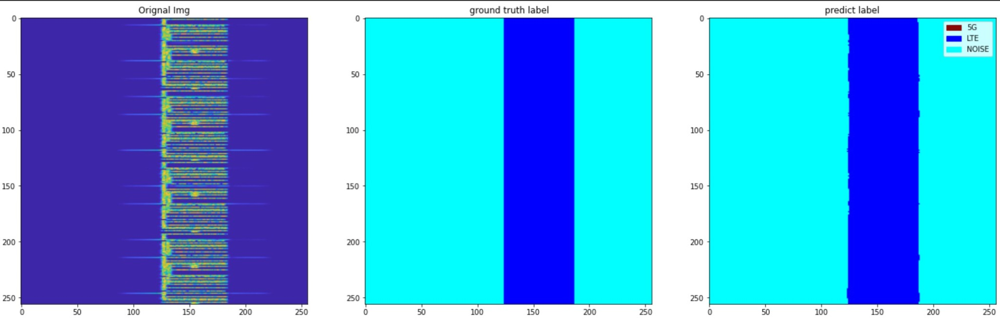

# Image-Segmentation-4G-5G

This project uses instance segmentation to classify LTE and 5G signals from images. The model employs a U-Net architecture to segment and label images containing LTE, 5G, or both bands.

## Project Overview

### Model
- **Architecture**: U-Net, a convolutional neural network designed for image segmentation tasks.
- **Purpose**: Segment and classify areas in an image into LTE, 5G, or noise regions.

### Example Results
- **Only LTE:**  
  

- **LTE and 5G:**  
  

### Files in the Repository
- **`LTE5GClassificationUNet.ipynb`**: Jupyter Notebook containing the implementation of the U-Net model for this classification task.
- **`Classified1.jpg`**: Example output showing the segmentation of an LTE-only image.
- **`Classified2.jpg`**: Example output showing segmentation of an image with both LTE and 5G bands.
- **`README.md`**: Documentation for the project.

## Usage

1. Clone the repository:
   ```bash
   git clone https://github.com/your-username/Image-Segmentation-4G-5G.git
   cd Image-Segmentation-4G-5G
   ```

2. Open the Jupyter Notebook (`LTE5GClassificationUNet.ipynb`) to train or test the U-Net model.

3. Modify the code to include your datasets or run the existing examples to replicate the results.

## Requirements
- Python 3.x
- TensorFlow
- NumPy
- Matplotlib
- Jupyter Notebook

## Description
The project demonstrates how U-Net can be adapted for signal classification in images, particularly LTE and 5G signals. It highlights the potential of deep learning in telecommunication-related image processing tasks.

## Data Source
The data used for this project was taken from:  
[https://de.mathworks.com/help/comm/ug/spectrum-sensing-with-deep-learning-to-identify-5g-and-lte-signals.html](https://de.mathworks.com/help/comm/ug/spectrum-sensing-with-deep-learning-to-identify-5g-and-lte-signals.html)
